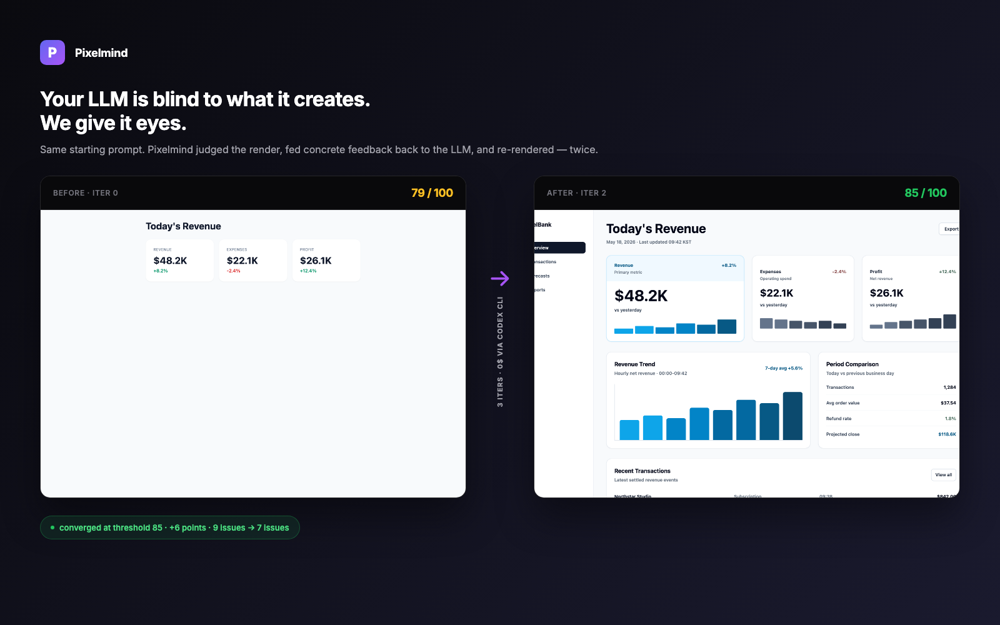

# Pixelmind

> **Your LLM is blind to what it creates. We give it eyes.**



A render-aware feedback loop for LLM-generated UI. Three primitives that close the gap between **code space** (where your LLM thinks) and **pixel space** (where users actually look).

```ts
import { render, see, critique, refine } from "@pixelmind/sdk"

const screenshot = await render({ code, viewport: "desktop" })
const verdict    = await see({ screenshot, intent: "fintech dashboard" })
const fixPrompt  = critique(verdict)
```

Or wire the whole loop in one call:

```ts
const result = await refine({
  initialCode,
  intent: "fintech dashboard, three KPI cards, trustworthy tone",
  threshold: 85,
  maxIters: 3,
  generate: (code, fix) => myLLM.complete(`${code}\n\n${fix}`),
})
// → { finalCode, finalScore: 85, iterations: 3, converged: true,
//     history: [{score:79}, {score:83}, {score:85}] }
```

## The problem

LLMs generate code in code-space (`p-4 gap-2 grid-cols-3`). Users see pixels. The translation is lossy — the LLM thinks it shipped a great dashboard, the rendered output is awkward. Today, every vibe coder closes the gap by hand: screenshot the result, eyeball it, type *"the spacing is off, the KPI cards feel cramped"* back into the chat. Pixelmind closes the loop **automatically**.

## How it works

1. **`render(code, viewport)`** — headless Chromium renders TSX/HTML, captures the screenshot
2. **`see(screenshot, intent)`** — a vision LLM judges the screenshot against 9 categories: hierarchy, spacing, typography, color, alignment, density, consistency, accessibility, brand-fit
3. **`critique(verdict)`** — the structured verdict becomes a natural-language fix prompt your LLM can act on

The 9-category rubric is grounded in [StyleSeed](https://github.com/bitjaru/styleseed)'s 69 production design rules — design knowledge as visual scaffolding, not just code lint.

## Quick start

```bash
# Install
npm i @pixelmind/sdk

# One-time: install the Playwright Chromium binary
npx playwright install chromium
```

Pick a vision backend:

| Backend | How to set up | Cost |
|---|---|---|
| **Codex CLI** (preferred) | `npx --yes -p @openai/codex codex login` | $0 — rides on your ChatGPT subscription |
| OpenAI API | `export OPENAI_API_KEY=sk-...` | ~$0.02 / evaluation |
| Anthropic API | `export ANTHROPIC_API_KEY=sk-ant-...` | ~$0.02 / evaluation |

Pixelmind auto-detects whichever is available, preferring Codex CLI when present.

## Reproduce the hero result

```bash
git clone https://github.com/bitjaru/pixelmind
cd pixelmind && npm install && npm run build
node scripts/smoke-refine.mjs
```

The script starts from a sparse JSX dashboard (`iter-0.tsx`), runs three refinement passes via Codex, and writes `scripts/iter-{0,1,2}.{png,tsx,json}` so you can see exactly what changed. Last run on this repo: **79 → 83 → 85** in three iterations, ~3 minutes wall time, $0 cost.

## API at a glance

```ts
// Verdict shape — same from every backend
type Verdict = {
  overallScore: number          // 0-100, weighted across categories
  scores: Record<Category, number>
  issues: Array<{
    type: Category
    severity: "low" | "med" | "high"
    desc: string                // what's wrong, specifically
    suggestion: string          // imperative fix the LLM can act on
  }>
  strengths: string[]           // preserve these on rewrite
  meta: { model: string; rubric: string; judgedAt: string }
}
```

## CLI

```bash
# Score a file and print the fix prompt
npx @pixelmind/cli fix src/components/Dashboard.tsx --intent "fintech dashboard"

# Score only, no fix prompt
npx @pixelmind/cli score src/components/Dashboard.tsx --intent "..."

# Short alias
npx pm fix src/components/Dashboard.tsx --intent "..."
```

## Status

V1 in active development. The SDK pipeline (`render` → `see` → `critique` → `refine`) is end-to-end validated against Codex CLI and OpenAI/Anthropic APIs. Next up: a public demo site and the first `0.1.0` npm release.

Star the repo to follow along.

## License

MIT — see [LICENSE](./LICENSE)
